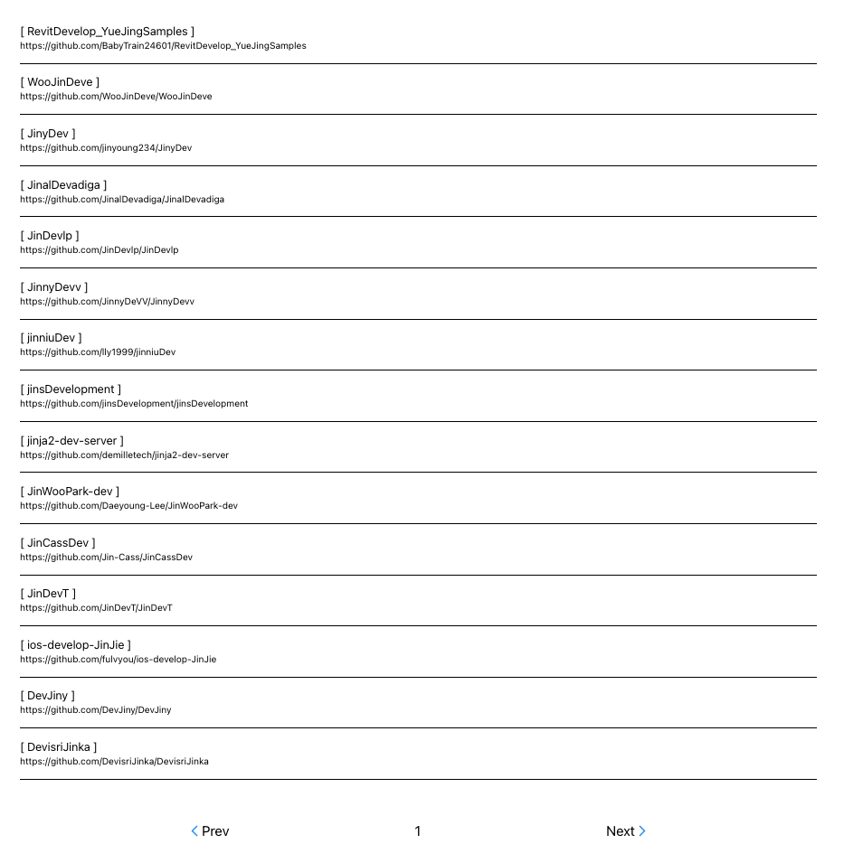

# Git Repo search (jin-dev)

#### A web application(react + typescript) that performs repository searches using GitHub API

## Table of contents

- [Demo](#demo)
- [Screen Shot](#screen-shot)
- [Tech Stack](#tech-stack)
- [How to install](#installation)
- [Components](#components)
- [utils](#utils)

## Demo

- Netlify : https://jin-dev-git-repo-search.netlify.app/

## Screen Shot

<table>
    <tr>
        <tr>
        <th>PC</th>
        </tr>
    </tr>
    <td> </td>
    <td> </td>
<tr>
    <tr>
    <th>Mobile</th>
    <tr>
    </tr>
      <td> </td>
    <td> </td>
</table>

## Tech-Stack

- react (18.2)
- typescript
- styled-components
- octokit

## Installation

to run my application, please follow steps below

```
1. yarn
2. yarn start
3. open a web browser and type 'http://localhost:3000/'
```

## Components

- Main : main page
- Search : consist of search layout with pagination
- SearchBox : contains search input text box
- SearchResult : prints search result

## utils

- loading : personal loading component
- octokit : it allows to use github API
- throttle : it allows to use throttling.
